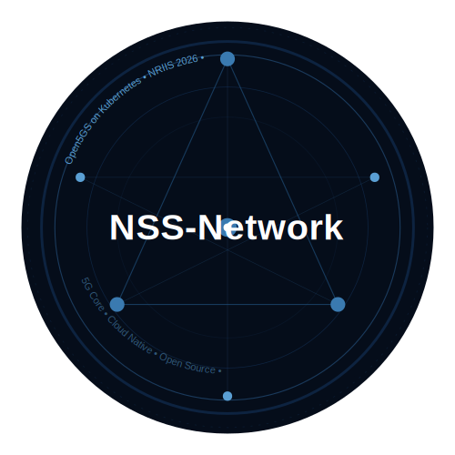

<div align="center">
  

  # Open5GS on Kubernetes

  **5G Core Network on Kubernetes — NRIIS 2026**

  [](LICENSE)
  [](https://kubernetes.io)
  [](https://open5gs.org)
</div>

---

## ภาษาไทย | Thai

### คืออะไร?
โปรเจคนี้เป็นคู่มือและ config สำหรับติดตั้ง **Open5GS 5G Core** บน **Kubernetes**
สำหรับทีมวิจัยและนักศึกษา โดย NSS-Network

### English
This project provides guides and configurations for deploying **Open5GS 5G Core** on **Kubernetes**,
maintained by NSS-Network for research teams and students.

---

## Concept พื้นฐาน / Basic Concepts

### Kubernetes คืออะไร?
Kubernetes (K8s) คือระบบจัดการ Container อัตโนมัติ ทำให้:
- Deploy application ได้ง่าย
- Scale ขึ้นลงได้อัตโนมัติ
- Restart อัตโนมัติเมื่อ application พัง
- จัดการ network และ storage ให้

### Open5GS คืออะไร?
Open5GS คือ Open Source 5G Core Network ประกอบด้วย Network Functions (NF):

| NF | ชื่อเต็ม | หน้าที่ |
|----|---------|--------|
| AMF | Access & Mobility Management | จัดการ UE registration, N2 |
| SMF | Session Management | จัดการ PDU session, N4 |
| UPF | User Plane | ส่ง traffic จริง, N3 |
| NRF | Network Repository | NF discovery |
| UDM | Unified Data Management | ข้อมูล subscriber |
| UDR | Unified Data Repository | Database layer |
| AUSF | Authentication Server | Authentication |
| PCF | Policy Control | Policy management |
| NSSF | Network Slice Selection | Network slicing |
| BSF | Binding Support | PCF binding |
| SCP | Service Communication Proxy | SBI proxy |

### โครงสร้างระบบ / Architecture

```
Hardware RU (Radio Unit)
        |  Wireless / CPRI
        v
OAI DU + CU  <--- Server 2 (10.162.0.3)
        |  N2 (SCTP:38412) / N3 (GTP-U:2152)
        v
Open5GS Core <--- Server 1 (10.162.0.1)
  AMF | SMF | UPF | NRF | UDM | ...
        |
        v
     MongoDB
```

---

## โครงสร้าง Repository

```
nriis2026-manifests/
├── README.md
├── LICENSE
├── docs/
│   ├── logo.svg
│   ├── md/
│   │   ├── 01-kubernetes-install.md
│   │   ├── 02-clone-github.md
│   │   ├── 03-open5gs-install.md
│   │   ├── 04-verify.md
│   │   ├── 05-update-config.md
│   │   └── 06-troubleshoot.md
│   └── docx/
└── server1-open5gs/
    ├── open5gs-2.2.0.tgz
    ├── trinergy_values.yaml
    └── manifests/
```

---

## ลำดับติดตั้ง / Installation Steps

| ขั้นที่ | หัวข้อ | คู่มือ |
|--------|--------|-------|
| 1 | ติดตั้ง Kubernetes | [md](docs/md/01-kubernetes-install.md) |
| 2 | Clone ไฟล์จาก GitHub | [md](docs/md/02-clone-github.md) |
| 3 | ติดตั้ง Open5GS | [md](docs/md/03-open5gs-install.md) |
| 4 | ตรวจสอบระบบ | [md](docs/md/04-verify.md) |
| 5 | การอัปเดต Config | [md](docs/md/05-update-config.md) |
| 6 | การแก้ปัญหาที่พบบ่อย | [md](docs/md/06-troubleshoot.md) |

---

## Quick Start

```bash
git clone git@github.com:NSS-Network/nriis2026-manifests.git
cd nriis2026-manifests/server1-open5gs
helm install open5gs open5gs-2.2.0.tgz -f trinergy_values.yaml
kubectl get pods
```

---

## Server Information

| Server | Role | IP | OS |
|--------|------|----|----|
| Server 1 | K8s Master + 5G Core | 10.162.0.1 | Ubuntu 24.04 |
| Server 2 | Worker + OAI CU/DU | 10.162.0.3 | Ubuntu 24.04 |

---

## Container Images (GHCR)

| Image | URL |
|-------|-----|
| Open5GS 2.7.0 | ghcr.io/nss-network/open5gs:2.7.0 |
| MongoDB 6.0 | ghcr.io/nss-network/mongo:6.0 |

---

## License

MIT License — ดูรายละเอียดที่ [LICENSE](LICENSE)

ใช้งานได้อย่างเสรี เผยแพร่ได้ แก้ไขได้ เพื่อประโยชน์สาธารณะและ community

---

<div align="center">
  <sub>Made with love for 5G Community — NSS-Network NRIIS 2026</sub>
</div>
